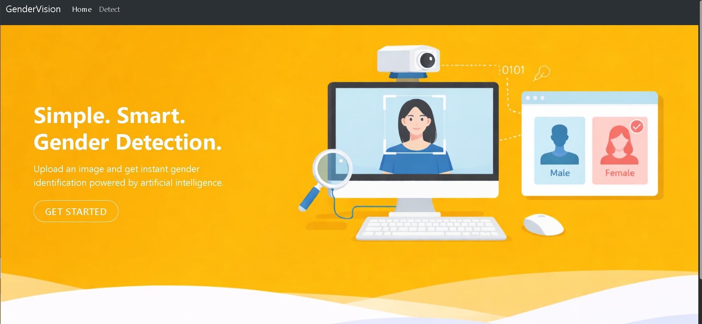
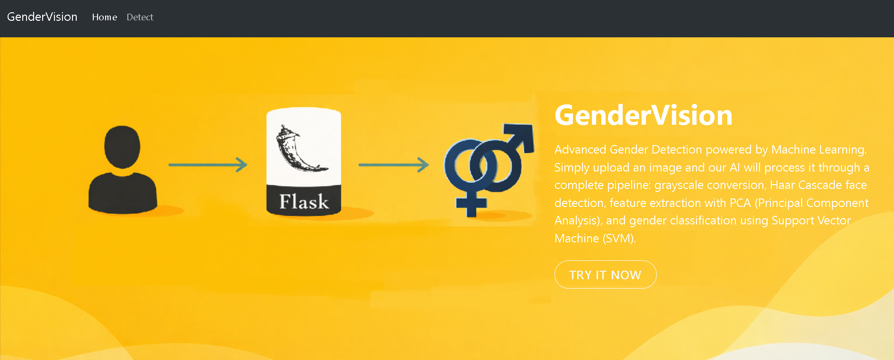
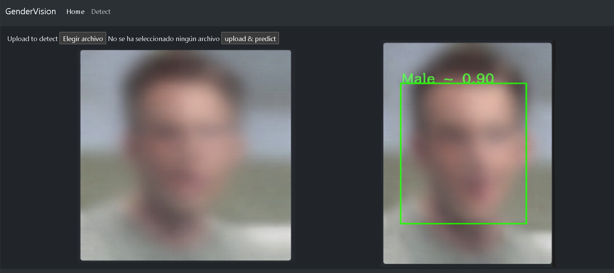

# Welcome to GenderVision

This is a demo project that shows how to create a web app using Flask and integrating a machine learning model. GenderVision takes a picture as an input and determines the gender of the person in the picture.

## ⚠️ Disclaimer
This is a **demonstration project** for educational and portfolio purposes only. 
It is NOT intended for production use and lacks security hardening required for real-world applications.

### Known Limitations:
- No file upload validation (accepts any file type)
- Debug mode enabled for development
- No authentication or user management system
- Simplified error handling
- Uploaded images are publicly accessible in static folders

***







***

## Getting Started

### Training Data

This project uses the **IMDB-WIKI dataset** for training. To obtain the training data:

1. Visit: [IMDB-WIKI Dataset](https://data.vision.ee.ethz.ch/cvl/rrothe/imdb-wiki/)
2. Download "faces only" (1GB)
3. Place the data in the `data/` directory

**Note**: The IMDB-WIKI dataset is provided for research purposes. Please review the dataset's license and terms of use before downloading.

### Setup Instructions

```bash
pip install -r requirements.txt
python modules/01-image_croping.py
python modules/02-structuring_data.py
python modules/03-data_preprocessing.py
python modules/04-eigen_images.py
python modules/05-model.py
```

Then run the flask app
```bash
flask --app server run
```

Once que app is open, navigate to http://127.0.0.1:5000/detect, choose a picture and then click in upload & predict button

## 📊 Dataset
- **Purpose:** Educational demonstration
- **Size:** 7,000 female + 7,000 male facial images
- **Usage:** Training and testing the gender classification model
- **Note:** This project uses sample data for demonstration purposes only

---

## 🔧 Known Limitations & Production Considerations

This is a demonstration project. For production use, consider:

- **Security:** Implement file upload validation with `secure_filename()` and file type checking
- **Configuration:** Disable debug mode and use environment variables for sensitive config
- **Error Handling:** Add comprehensive try-catch blocks and user-friendly error messages
- **Privacy:** Implement data retention policies and user consent mechanisms
- **Performance:** Add image size limits and async processing for scalability
- **Bias Considerations:** Gender classification models may have accuracy limitations across diverse populations

---

## License

This project is licensed under the MIT License - see the [LICENSE](LICENSE) file for details.

The IMDB-WIKI dataset is used under the terms specified by its creators.